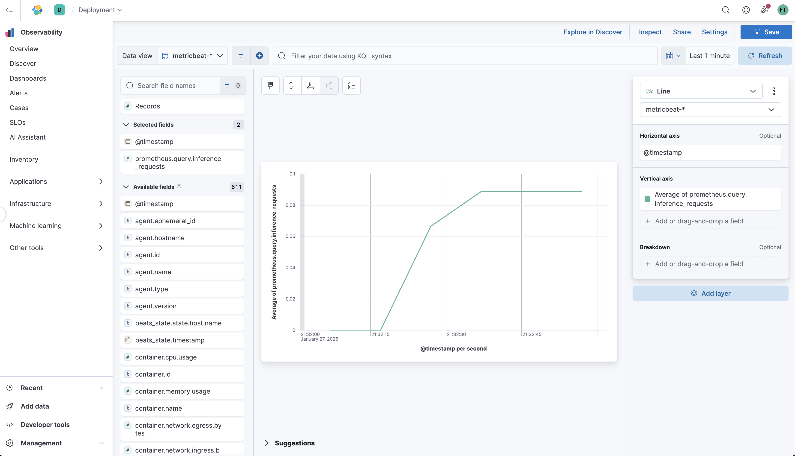

# Getting started with KServe (locally)

Sources:
- https://kserve.github.io/website/latest/get_started/
- https://www.elastic.co/guide/en/beats/metricbeat/8.17/running-on-kubernetes.html
  
## Pre-requisites

```
$ brew install kind
$ brew install kubectl
$ brew install helm
```

## Create a local cluster using kind

```
$ kind create cluster --config kind-config.yaml
```
Output:
```
Creating cluster "kind" ...
 ✓ Ensuring node image (kindest/node:v1.32.0) 🖼
 ✓ Preparing nodes 📦  
 ✓ Writing configuration 📜 
 ✓ Starting control-plane 🕹️ 
 ✓ Installing CNI 🔌 
 ✓ Installing StorageClass 💾 
Set kubectl context to "kind-kind"
You can now use your cluster with:

kubectl cluster-info --context kind-kind

Have a question, bug, or feature request? Let us know! https://kind.sigs.k8s.io/#community 🙂
```

## Install KServe

```
$ curl -s "https://raw.githubusercontent.com/kserve/kserve/refs/tags/v0.14.1/hack/quick_install.sh" | bash
```
Output:
```
WARNING: version difference between client (1.30) and server (1.32) exceeds the supported minor version skew of +/-1
"istio" has been added to your repositories
NAME: istio-base
LAST DEPLOYED: Sun Jan 26 15:31:58 2025
NAMESPACE: istio-system
STATUS: deployed
REVISION: 1
TEST SUITE: None
NOTES:
Istio base successfully installed!

To learn more about the release, try:
  $ helm status istio-base
  $ helm get all istio-base
NAME: istiod
LAST DEPLOYED: Sun Jan 26 15:31:58 2025
NAMESPACE: istio-system
STATUS: deployed
REVISION: 1
TEST SUITE: None
NOTES:
"istiod" successfully installed!

To learn more about the release, try:
  $ helm status istiod
  $ helm get all istiod

Next steps:
  * Deploy a Gateway: https://istio.io/latest/docs/setup/additional-setup/gateway/
  * Try out our tasks to get started on common configurations:
    * https://istio.io/latest/docs/tasks/traffic-management
    * https://istio.io/latest/docs/tasks/security/
    * https://istio.io/latest/docs/tasks/policy-enforcement/
  * Review the list of actively supported releases, CVE publications and our hardening guide:
    * https://istio.io/latest/docs/releases/supported-releases/
    * https://istio.io/latest/news/security/
    * https://istio.io/latest/docs/ops/best-practices/security/

For further documentation see https://istio.io website
NAME: istio-ingressgateway
LAST DEPLOYED: Sun Jan 26 15:32:19 2025
NAMESPACE: istio-system
STATUS: deployed
REVISION: 1
TEST SUITE: None
NOTES:
"istio-ingressgateway" successfully installed!

To learn more about the release, try:
  $ helm status istio-ingressgateway
  $ helm get all istio-ingressgateway

Next steps:
  * Deploy an HTTP Gateway: https://istio.io/latest/docs/tasks/traffic-management/ingress/ingress-control/
  * Deploy an HTTPS Gateway: https://istio.io/latest/docs/tasks/traffic-management/ingress/secure-ingress/
pod/istio-ingressgateway-86669c5fbf-8rxkl condition met
😀 Successfully installed Istio
"jetstack" has been added to your repositories
NAME: cert-manager
LAST DEPLOYED: Sun Jan 26 15:32:36 2025
NAMESPACE: cert-manager
STATUS: deployed
REVISION: 1
TEST SUITE: None
NOTES:
cert-manager v1.15.1 has been deployed successfully!

In order to begin issuing certificates, you will need to set up a ClusterIssuer
or Issuer resource (for example, by creating a 'letsencrypt-staging' issuer).

More information on the different types of issuers and how to configure them
can be found in our documentation:

https://cert-manager.io/docs/configuration/

For information on how to configure cert-manager to automatically provision
Certificates for Ingress resources, take a look at the `ingress-shim`
documentation:

https://cert-manager.io/docs/usage/ingress/
😀 Successfully installed Cert Manager
NAME: knative-operator
LAST DEPLOYED: Sun Jan 26 15:33:04 2025
NAMESPACE: knative-serving
STATUS: deployed
REVISION: 1
TEST SUITE: None
knativeserving.operator.knative.dev/knative-serving created
😀 Successfully installed Knative
bash: line 133: [: =: unary operator expected
Pulled: ghcr.io/kserve/charts/kserve-crd:v0.14.1
Digest: sha256:b5f4f22fae8fa747ef839e1b228e74e97a78416235eb5f35da49110d25b3d1e7
NAME: kserve-crd
LAST DEPLOYED: Sun Jan 26 15:33:21 2025
NAMESPACE: kserve
STATUS: deployed
REVISION: 1
TEST SUITE: None
Pulled: ghcr.io/kserve/charts/kserve:v0.14.1
Digest: sha256:e65039d9e91b16d429f5fb56528e15a4695ff106a41eeae07f1f697abe974bd5
NAME: kserve
LAST DEPLOYED: Sun Jan 26 15:33:25 2025
NAMESPACE: kserve
STATUS: deployed
REVISION: 1
TEST SUITE: None
😀 Successfully installed KServe
```

## Create new namespace for deploying KServe resources

```
$ kubectl create namespace kserve-test
```
Output:
```
namespace/kserve-test created
```

## Create an InferenceService

```
$ kubectl apply -n kserve-test -f kserve-inference-config.yaml --wait
$ kubectl wait --for=condition=Ready --timeout=300s inferenceservice/sklearn-iris -n kserve-test
```
Output:
```
inferenceservice.serving.kserve.io/sklearn-iris created
inferenceservice.serving.kserve.io/sklearn-iris condition met
```

## Check Istio Ingress Service

```
$ kubectl get services -n istio-system
```
Output:
```
NAME                    TYPE           CLUSTER-IP      EXTERNAL-IP   PORT(S)                                      AGE
istio-ingressgateway    LoadBalancer   10.96.73.196    <pending>     15021:31478/TCP,80:30555/TCP,443:31950/TCP   22m
istiod                  ClusterIP      10.96.19.55     <none>        15010/TCP,15012/TCP,443/TCP,15014/TCP        23m
knative-local-gateway   ClusterIP      10.96.229.196   <none>        80/TCP                                       21m
```

The EXTERNAL-IP shows `<pending>` because kind does not provide an external load balancer, thus traffic cannot directly route to the Istio ingress gateway. 

Port-forwarding allows us to forward requests to the gateway's port 80 locally on localhost:8080.

```
$ export INGRESS_GATEWAY_SERVICE=$(kubectl get service -n istio-system -l "app=istio-ingressgateway" -o jsonpath="{.items[0].metadata.name}")
$ export INGRESS_PORT=8080
$ kubectl port-forward -n istio-system svc/${INGRESS_GATEWAY_SERVICE} $INGRESS_PORT:80
```
Output:
```
Forwarding from 127.0.0.1:8080 -> 80
Forwarding from [::1]:8080 -> 80

```

## Send a request

```
$ export INGRESS_PORT=8080
$ export SERVICE_HOSTNAME=$(kubectl get inferenceservice sklearn-iris -n kserve-test -o jsonpath="{.status.url}" | cut -d "/" -f 3)
$ curl -v -H "Host: ${SERVICE_HOSTNAME}" \
  -H "Content-Type: application/json" \
  "http://localhost:${INGRESS_PORT}/v1/models/sklearn-iris:predict" \
  -d @./iris-input.json
```
Output:
```
* Host localhost:8080 was resolved.
* IPv6: ::1
* IPv4: 127.0.0.1
*   Trying [::1]:8080...
* Connected to localhost (::1) port 8080
> POST /v1/models/sklearn-iris:predict HTTP/1.1
> Host: sklearn-iris.kserve-test.example.com
> User-Agent: curl/8.7.1
> Accept: */*
> Content-Type: application/json
> Content-Length: 188
> 
* upload completely sent off: 188 bytes
< HTTP/1.1 200 OK
< content-length: 21
< content-type: application/json
< date: Sun, 26 Jan 2025 20:18:49 GMT
< server: istio-envoy
< x-envoy-upstream-service-time: 5
< 
* Connection #0 to host localhost left intact
{"predictions":[1,1]}
```

> Note: the Host header is critical for Istio to route the request properly. Istio uses the Host header to match the hostname defined in the VirtualService.

## Install Prometheus

```
$ helm repo add prometheus-community https://prometheus-community.github.io/helm-charts
$ helm repo update
$ helm install prometheus prometheus-community/kube-prometheus-stack -n prometheus --create-namespace
```
Output:
```
"prometheus-community" already exists with the same configuration, skipping
Hang tight while we grab the latest from your chart repositories...
...Successfully got an update from the "istio" chart repository
...Successfully got an update from the "elastic" chart repository
...Successfully got an update from the "jetstack" chart repository
...Successfully got an update from the "prometheus-community" chart repository
NAME: prometheus
LAST DEPLOYED: Mon Jan 27 13:12:43 2025
NAMESPACE: prometheus
STATUS: deployed
REVISION: 1
NOTES:
kube-prometheus-stack has been installed. Check its status by running:
  kubectl --namespace prometheus get pods -l "release=prometheus"

Visit https://github.com/prometheus-operator/kube-prometheus for instructions on how to create & configure Alertmanager and Prometheus instances using the Operator.
```


## Create a MonitorService

```
$ kubectl apply -f kserve-monitor-config.yaml -n prometheus --wait
```
Output:
```
servicemonitor.monitoring.coreos.com/sklearn-iris-monitor created
```

## Send queries to Prometheus

```
$ export PROMETHEUS_PORT=$(kubectl get services -n prometheus -l "app=kube-prometheus-stack-prometheus" -o jsonpath="{.items[0].spec.ports[0].port}")
$ export PROMETHEUS_POD=$(kubectl get pods -n prometheus -l "app.kubernetes.io/instance=prometheus-kube-prometheus-prometheus" -o jsonpath="{.items[0].metadata.name}")
$ kubectl wait --for=condition=Ready --timeout=300s pod/$PROMETHEUS_POD -n prometheus
$ kubectl port-forward svc/prometheus-kube-prometheus-prometheus -n prometheus $PROMETHEUS_PORT:$PROMETHEUS_PORT
```
Output:
```
Forwarding from 127.0.0.1:9090 -> 9090
Forwarding from [::1]:9090 -> 9090

```

From the dashboard, run a query like `sum(increase(revision_request_latencies_count{service_name="sklearn-iris-predictor"}[1d]))` to get the number of requests received by the service in the past 24 hours.

Or alternatively run:

```
$ curl -G "http://localhost:9090/api/v1/query" \
     --data-urlencode "query=sum(increase(revision_request_latencies_count{service_name='sklearn-iris-predictor'}[1d]))"
```
Output:
```
{"status":"success","data":{"resultType":"vector","result":[{"metric":{},"value":[1737994669.063,"15.08333333333333"]}]}}%
```

> Note: make a few requests to see a non-zero value. 

## Send metrics to Elastic Cloud using Metricbeat

```
$ kubectl create -f metricbeat-config.yaml
```
Output:
```
serviceaccount/metricbeat created
clusterrole.rbac.authorization.k8s.io/metricbeat created
role.rbac.authorization.k8s.io/metricbeat created
role.rbac.authorization.k8s.io/metricbeat-kubeadm-config created
clusterrolebinding.rbac.authorization.k8s.io/metricbeat created
rolebinding.rbac.authorization.k8s.io/metricbeat created
rolebinding.rbac.authorization.k8s.io/metricbeat-kubeadm-config created
configmap/metricbeat-daemonset-config created
configmap/metricbeat-daemonset-modules created
daemonset.apps/metricbeat created
```

1. Go to cloud.elastic.co
2. Select deployment for he Cloud ID used in metricbeat-config.yaml
3. Click Open Kibana
4. Go to Discover
5. From Data View, select Create Data View, using name Metricbeat and pattern metricbeat-*
6. Search the field `prometheus.query.inference_requests` which we defined as `sum(rate(revision_request_latencies_count{service_name='sklearn-iris-predictor'}[1m]))`

